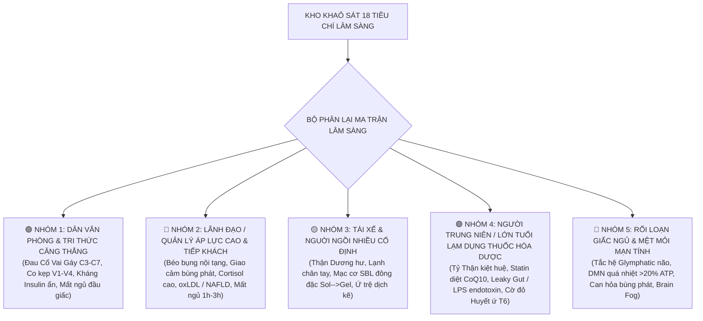

# MA TRẬN TÌNH HUỐNG LÂM SÀNG THƯỜNG GẶP & PHÁC ĐỒ ĐIỀU HÒA (TINH - KHÍ - THẦN)
> **Tài liệu hướng dẫn lâm sàng dành cho Bác sĩ & Chuyên gia Y học Tích hợp Tam Bảo**
> *Trích xuất & Hợp nhất từ Đề Án Sản Phẩm Digital và Sách Giải Mã Cơ Chế Nền Đột Quỵ & Ung Thư (BS. Trần Thăng Long)*

---

## 📌 I. TỔNG QUAN HỆ THỐNG PHÂN TẦNG LÂM SÀNG

Toàn bộ bệnh nhân/khách hàng tiến hành khảo sát 18 tiêu chí lâm sàng sẽ được phân loại dựa trên **Biểu hiện triệu chứng (Symptom-based)** và **Cơ chế nền phân tử (Molecular & Energetic Pathology)** thành 5 Nhóm Tình Huống Lâm Sàng Thường Gặp nhất.



---

## 📋 II. 5 TÌNH HUỐNG LÂM SÀNG THƯỜNG GẶP CHUYÊN SÂU

### 1. 🟢 NHÓM 1: DÂN VĂN PHÒNG & TRI THỨC CĂNG THẲNG (OFFICE WORKERS)

#### A. Hồ Sơ Đối Tượng:
* **Đặc trưng:** Ngồi máy tính $> 6-8$ tiếng/ngày, ít vận động, hít thở nông, chế độ ăn nhiều tinh bột nhanh/cà phê.
* **Bộ Tiêu Chí Điểm Cao:** `K2` (Co kẹp cổ vai gáy 🚩), `K3` (Ngồi liên tục $>50$p), `T3` (Buồn ngủ gà gật sau ăn), `S2` (DMN vỏ não quá nhiệt), `S6` (Ánh sáng xanh trước ngủ).

#### B. Giải Mã Cơ Chế Nền (Đông ↔ Tây Y):
* **Trục KHÍ (Cơ chế V1-V4 & Sol-Gel):** Nhóm cơ dưới chẩm và mạc cơ cổ gáy co cứng mạn tính kẹp ép trực tiếp lên **Động mạch đốt sống (Vertebral Artery $V1-V4$)**, làm giảm $50-70\%$ lượng máu tươi mang oxy nuôi não hộ. Dịch gian bào vùng cổ gáy chuyển từ pha *Sol (linh hoạt)* sang pha *Gel (dính đặc)*.
* **Trục TINH (Kháng Insulin ẩn & Vi viêm):** Thói quen ăn tinh bột đơn và ngồi lâu làm tế bào cơ bắp không tiêu thụ Glucose ➔ Kháng Insulin thể ẩn (tích mỡ bụng dưới, vi viêm mạc cơ AGEs).
* **Trục THẦN (DMN quá nhiệt & Giấc ngủ nông):** Xem màn hình xanh và lo âu công việc khiến Mạng lưới DMN vỏ não tiêu tốn $>20\%$ tổng ATP ti thể toàn thân, làm não khó vào giấc ngủ ($>30$ phút).

#### C. Phác Đồ Can Thiệp MED 80/20 (30 Ngày Đầu):
1. **Bài tập Micro-break 2 phút:** Cứ 50 phút ngồi làm việc ➔ Đứng dậy nhón gót, xả kẹp đốt sống cổ chẩm và thở bụng 3 nhịp.
2. **Kỹ thuật thở 4-7-8 trước ngủ:** Hít vào 4s ➔ Giữ 7s ➔ Thở ra chậm 8s (thực hiện 10 phút) để chuyển sóng não sang Alpha ($8-12Hz$).
3. **Điều chỉnh thứ tự ăn uống:** Ăn theo thứ tự Rau kiềm ➔ Đạm ➔ Tinh bột chậm. Cắt hoàn toàn trà sữa/nước ngọt chiều.

---

### 2. 🔴 NHÓM 2: LÃNH ĐẠO / QUẢN LÝ ÁP LỰC CAO & TIẾP KHÁCH (MANAGERS & EXECUTIVES)

#### A. Hồ Sơ Đối Tượng:
* **Đặc trưng:** Áp lực doanh số/quản trị mạn tính, thường xuyên tiếp khách bia rượu, ăn uống thất thường, stress cao.
* **Bộ Tiêu Chí Điểm Cao:** `S3` (Tim đập nhanh, Giao cảm bùng phát 🚩), `S5` (Tỉnh giấc 1h-3h sáng), `T4` (Gan nhiễm mỡ/Mỡ máu), `T5` (Nhức khớp/Axit Uric), `S1` (Bí bách ngực sườn/Can uất).

#### B. Giải Mã Cơ Chế Nền (Đông ↔ Tây Y):
* **Trục THẦN (Quá tải HPA & Tắc Glymphatic):** Stress mạn tính làm Trục HPA liên tục tiết **Cortisol & Adrenaline** ban đêm ➔ Suy giảm trương lực phế vị (Low HRV), ức chế Tuyến Tùng tiết Melatonin. Hệ Glymphatic não bị tắc nghẽn hoàn toàn ➔ **Thần trí bất an, Can Hỏa bùng phát trằn trọc đúng khung giờ 1h-3h sáng** (Giờ lưu chú Kinh Can).
* **Trục TINH (oxLDL & Tế Bào Bọt - Foam Cells):** Bia rượu và đồ ăn giàu mỡ xấu kết hợp với Stress Oxy Hóa nội mô ($ROS Storm$) làm LDL biến đổi thành **oxLDL (Đàm Trọc Độc Hại)**. Đại thực bào nuốt oxLDL qua thụ thể $CD36/SR-A$ biến thành **Tế bào bọt (Foam cells)** ➔ Lõi xơ vữa mỏng, nguy cơ bùng phát Đột Quỵ cấp tính.
* **Trục KHÍ (Can Khí Uất Kết ➔ Lục Uất):** Tình chí đè nén làm Can mất tính sơ tiết ➔ Tiến trình Lục Uất (Khí ➔ Huyết ➔ Thấp ➔ Đàm ➔ Hỏa ➔ Thực uất) bùng phát làm sụp đổ tiêu hóa & hệ miễn dịch.

#### C. Phác Đồ Can Thiệp MED 80/20 (30 Ngày Đầu):
1. **Thiền Định Định Tĩnh 15 phút (21:30):** Ngắt toàn bộ điện thoại/công việc sau 21:00. Ngâm chân nước ấm thảo dược + Thiền chánh niệm quét thân (Body Scan) để dập tắt Cơn bão Giao cảm.
2. **Dinh dưỡng Kháng Viêm & Giải Độc Can:** Bổ sung thực phẩm giàu Quercetin (Hành tây tím) & Resveratrol (Nho đen/Trà xanh) để hàn kín nội mô mạch máu và quét sạch oxLDL.
3. **Cắt bữa phụ đêm & Nhịn ăn gián đoạn 16/8:** Không ăn gì sau 19:30 để Tỳ Vị và Can Đởm nghỉ ngơi giải độc ban đêm.

---

### 3. 🟡 NHÓM 3: TÀI XẾ & NGƯỜI NGỒI NHIỀU CỐ ĐỊNH (DRIVERS & STATIONARY WORKERS)

#### A. Hồ Sơ Đối Tượng:
* **Đặc trưng:** Rung xóc xe mạn tính, ngồi lái xe nhiều giờ liên tục, ít uống nước, sợ đi vệ sinh trên đường.
* **Bộ Tiêu Chí Điểm Cao:** `K4` (Thắt lưng lạnh mỏi, sợ lạnh chân), `K5` (Bắp chân nặng như đeo chì chiều tối), `K3` (Ngồi cố định), `T1` (Đồ ăn nhanh dọc đường), `K1` (Cơ thể uể oải hụt hơi).

#### B. Giải Mã Cơ Chế Nền (Đông ↔ Tây Y):
* **Trục KHÍ (Thận Dương Hư & Dịch Gian Bào Đông Đặc):** Ngồi liên tục và rung xóc làm liệt dòng chảy vi tuần hoàn vùng chậu thắt lưng ➔ **Thận Dương hư suy, Mệnh Môn hỏa yếu**. Dịch gian bào Proteoglycan ở hai bắp chân bị ứ trệ, đông đặc từ pha *Sol (lỏng)* sang pha *Gel (đặc)* ➔ Chân nặng trịch như đeo chì vào chiều tối.
* **Trục TINH (Thoái Hóa Cột Sống L2-L3 & Mất Nước Đĩa Đệm):** Sai tư thế kéo dài và thiếu nước tế bào làm đĩa đệm thắt lưng bị mất nước mạn tính, suy giảm dinh dưỡng nuôi mạc cơ chuỗi sau (SBL) ➔ Đau lưng âm ỉ, lạnh mỏi thắt lưng.
* **Trục THẦN (Vệ Khí Suy Giảm):** Thận Dương yếu không phát động được Vệ khí ra ngoài bì phu ➔ Cơ thể rất dễ cảm lạnh, sợ gió lạnh, sợ máy lạnh.

#### C. Phác Đồ Can Thiệp MED 80/20 (30 Ngày Đầu):
1. **Cứu Ấm Vùng Thắt Lưng Mệnh Môn (L2-L3):** Dùng đai chườm thảo dược nóng (ZenBelt) 20 phút mỗi tối để kích hoạt Mệnh Môn Hỏa, phục hồi Thận Dương.
2. **Uống Nước Tế Bào Kiềm Hóa Đúng Cách:** Uống đủ 2 lit nước ấm/ngày, chia làm nhiều ngụm nhỏ, không uống dồn một lúc.
3. **Bài tập nhón gót xả trệ bắp chân:** Khi dừng xe hoặc nghỉ giữa chặng ➔ Nhón gót chân 30 lần để kích hoạt "bơm cơ bắp chân" đẩy dịch gian bào pha Gel trở lại hệ tuần hoàn.

---

### 4. 🟣 NHÓM 4: NGƯỜI TRUNG NIÊN / LỚN TUỔI LẠM DỤNG THUỐC HÓA DƯỢC (CHRONIC POLYPHARMACY PATIENTS)

#### A. Hồ Sơ Đối Tượng:
* **Đặc trưng:** Tuổi $> 50$, có tiền sử mắc bệnh mạn tính (huyết áp, mỡ máu, tiểu đường, khớp), uống từ 3-5 loại thuốc tây hàng ngày kéo dài nhiều năm.
* **Bộ Tiêu Chí Điểm Cao:** `T2` (Hễ mệt/đau là uống thuốc cấp tốc), `T6` (Mụn nhọt, vết bầm tím, u xơ/polyp 🚩), `T4` (Men gan/Mỡ máu), `K1` (Khí hư uể oải), `S4` (Ngủ chập chờn hay mê).

#### B. Giải Mã Cơ Chế Nền (Đông ↔ Tây Y):
* **Sự Tấn Công Toàn Diện Của "Dược Độc Ngoại Nhập" Lên Tam Bảo:**
  * *Tầng TINH (Vắt kiệt Thận Tinh & Leaky Gut):* Lạm dụng Corticoid vắt kiệt Thận Tinh Tiên Thiên, làm mục xương và teo thượng thận. Kháng sinh phổ rộng thảm sát $99\%$ vi sinh ruột ➔ **Rò rỉ ruột (Leaky Gut)** đẩy độc tố $LPS$ vào máu gây vi viêm gian bào mạn tính.
  * *Tầng KHÍ (Statin Tắt Nắng Ti Thể):* Statin ức chế HMG-CoA Reductase làm sụt giảm $40-50\%$ CoQ10 trong ti thể ➔ **Triệt hạ ATP hiếu khí**, gây đau nhức mạc cơ mạn tính và mệt mỏi trệ khí.
  * *Tầng THẦN (Benzodiazepine Ép Ngủ & Tắc Glymphatic):* Thuốc an thần triệt hạ giấc ngủ sóng chậm Delta ($0.5-4Hz$) ➔ Hệ Glymphatic bị tê liệt hoàn toàn, tích tụ Amyloid-beta gây sa sút trí tuệ và MÙ MIỄN DỊCH (tế bào NK bị ức chế).
* **Cờ Đỏ T6 (Huyết Ứ & Suy Giảm Giám Sát Phân Bào):** Dược độc chìm sâu vào Tạng phủ và Xương tủy mà không thể đùn ra ngoài da (do Vệ khí suy) ➔ Hình thành hạch u xơ, vôi hóa và biến tính mô (**Nền tảng Ung thư**).

#### C. Phác Đồ Can Thiệp MED 80/20 (30 Ngày Đầu):
1. **Phác đồ Dọn Rác Gian Bào & Nuôi Tỳ Vị:** Sử dụng thực phẩm nguyên bản giàu Tinh (bột dưỡng sinh kiềm hóa ZenJing) để phục hồi niêm mạc ruột và cung cấp Tinh Hậu Thiên nuôi tế bào.
2. **Kích hoạt Phục Hồi Ti Thể:** Ngưng lạm dụng thuốc giảm đau/kháng sinh tùy tiện. Bổ sung dưỡng chất sinh học tự nhiên để khôi phục chỉ số CoQ10 và ATP.
3. **Thủy Hỏa Ký Tế Đêm:** Ngâm chân thảo dược + massage lòng bàn chân (Huyệt Dũng Tuyền) trước ngủ 20 phút để kéo Tâm Hỏa xuống hòa nhập với Thận Thủy.

---

### 5. 🔵 NHÓM 5: RỐI LOẠN GIẤC NGỦ & MỆT MỎI MẠN TÍNH (INSOMNIA & CHRONIC FATIGUE)

#### A. Hồ Sơ Đối Tượng:
* **Đặc trưng:** Trằn trọc khó ngủ, ngủ hay mơ, sáng dậy đầu óc nặng trịch như chưa ngủ, sương mù brain (Brain Fog), mất tập trung.
* **Bộ Tiêu Chí Điểm Cao:** `S4` (Mất $>30$p mới ngủ được), `S5` (Tỉnh giấc 1h-3h sáng), `S2` (Suy nghĩ miên man DMN), `K1` (Hụt hơi uể oải), `S1` (Uất ức ngực sườn).

#### B. Giải Mã Cơ Chế Nền (Đông ↔ Tây Y):
* **4 Thể Bệnh YHCT Cốt Lõi:**
  1. *Tâm Thận Bất Giao:* Thượng Đan Điền (Tâm hỏa) nung nấu không chìm xuống được Hạ Đan Điền (Thận thủy) ➔ Trằn trọc cả đêm, bồn chồn.
  2. *Can Khí Uất Kết / Can Hỏa Thượng Rung:* Uất ức tình chí làm Can hỏa bùng phát ➔ Thức giấc trằn trọc đúng khung giờ $1h-3h$ sáng.
  3. *Vị Bất Hòa Tắc Ngọa Bất An:* Ăn tối muộn, đồ siêu chế biến làm Đàm thấp ứ trệ Trung Tiêu ➔ Đầy bụng, khó ngủ.
  4. *Vinh Vệ Bất Hòa:* Vệ khí bị uất kẹt ngoài mạc cơ ban đêm, không nhập được vào Âm ➔ Mắt mở thao thao.
* **Giải Mã YHHĐ Thần Kinh & DMN:** Mạng lưới DMN vỏ não quá nhiệt tiêu tốn nguồn ATP ti thể. Cortisol đêm cao làm ức chế Tuyến Tùng tiết Melatonin. Hệ Glymphatic bị tắc nghẽn ➔ Độc tố gian bào não tích tụ gây sương mù não ($Brain Fog$) và suy giảm trí nhớ.

#### C. Phác Đồ Can Thiệp MED 80/20 (30 Ngày Đầu):
1. **Thiết lập Vùng Tối & Ngắt Ánh Sáng Xanh (Sau 21:30):** Tắt toàn bộ thiết bị điện tử 60 phút trước khi ngủ để kích hoạt Tuyến Tùng tiết Melatonin tự nhiên.
2. **Kỹ thuật Thở Cơ Hoành Đan Điền:** Hít sâu phồng bụng ➔ Thở chậm xẹp bụng 10 phút trên giường ngủ để kích hoạt thần kinh phế vị (Vagus Nerve) kéo sóng não về Theta ($4-8Hz$).
3. **Trà Thảo Mộc Định Tĩnh:** Dùng trà thảo mộc Lạc tiên, Tâm sen, Cúc hoa ấm vào 20:30 để thanh Can hạ hỏa, an định tâm trí.

---

## 📊 III. BẢNG MA TRẬN TRA CỨU LÂM SÀNG NHANH (CLINICAL MATRIX LOOKUP)

| Nhóm Lâm Sàng | Tiêu Chí Khảo Sát Điểm Cao | Cơ Chế Nền Sinh Học (YHHĐ ↔ YHCT) | Cờ Đỏ Alert | Phác Đồ MED 80/20 Ưu Tiên |
| :--- | :--- | :--- | :---: | :--- |
| **1. Dân Văn Phòng** | `K2, K3, T3, S2, S6` | Co kẹp V1-V4 ↔ Kháng Insulin ẩn ↔ DMN quá nhiệt | 🚩 `K2` | Bài tập Micro-break 2 phút + Thở 4-7-8 + Thứ tự ăn uống |
| **2. Lãnh Đạo / Quản Lý** | `S3, S5, T4, T5, S1` | HPA Cortisol đêm ↔ oxLDL & Foam Cells ↔ Can Uất Lục Uất | 🚩 `S3` | Thiền quét thân 15p + Quercetin/Resveratrol + Nhịn ăn 16/8 |
| **3. Tài Xế / Ngồi Nhiều** | `K4, K5, K3, T1, K1` | Thận Dương hư ↔ Mạc cơ SBL Gel ↔ L2-L3 mất nước | - | Cứu ấm Mệnh Môn L2-L3 + Uống nước kiềm + Nhón gót xả Gel |
| **4. Lạm Dụng Thuốc** | `T2, T6, T4, K1, S4` | Vắt kiệt Thận Tinh ↔ Statin diệt CoQ10 ↔ Leaky Gut LPS | 🚩 `T6` | Bột dưỡng sinh ZenJing + Khôi phục ti thể + Thủy Hỏa Ký Tế |
| **5. Rối Loạn Giấc Ngủ** | `S4, S5, S2, K1, S1` | Tắc Glymphatic ➔ Can hỏa bùng 1h-3h ➔ Tâm Thận Bất Giao | - | Ngắt ánh sáng xanh 21:30 + Thở Đan Điền + Trà Tâm Sen Lạc Tiên |

---

## 🤖 IV. BỘ PROMPT TEMPLATE MẪU DÀNH CHO BÁC SĨ (KHI SỬ DỤNG AI CO-PILOT)

Khi có thông tin bệnh nhân từ Google Sheets, Bác sĩ chỉ cần Copy đoạn Prompt dưới đây dán vào AI (Gemini / Claude) để sinh ra đoạn phân tích lâm sàng cá nhân hóa sắc nét:

```text
Bạn là Trợ lý Y khoa Cao cấp làm việc cùng BS. Trần Thăng Long (Hệ thống Y học Tích hợp Tam Bảo).
Hãy phân tích ca lâm sàng dưới đây dựa trên cuốn sách MASTER "GIẢI MÃ CƠ CHẾ NỀN GÂY ĐỘT QUY VÀ UNG THƯ BY TINH KHÍ THẦN":

THÔNG TIN BỆNH NHÂN:
- Họ và tên: {{Họ Tên}} | Tuổi: {{Tuổi}} | Giới tính: {{Giới tính}} | Nghề nghiệp: {{Nghề nghiệp}}
- Điểm Tinh: {{Điểm Tinh}}/12 ({{%Tinh}}%) | Điểm Khí: {{Điểm Khí}}/12 ({{%Khí}}%) | Điểm Thần: {{Điểm Thần}}/12 ({{%Thần}}%)
- Tổng điểm rác sinh học: {{Tổng điểm}}/36 | Vùng nguy cơ: {{Vùng nguy cơ}}
- Top triệu chứng ghi nhận: {{Top 5 triệu chứng}}

YÊU CẦU ĐẦU RA (ĐỊNH DẠNG MARKDOWN CHUẨN Y TẾ):
1. ĐÁNH GIÁ NHÓM TÌNH HUỐNG LÂM SÀNG: Xác định bệnh nhân thuộc nhóm nào trong 5 Nhóm Lâm Sàng Tam Bảo (Dân văn phòng / Lãnh đạo / Tài xế / Lạm dụng thuốc / Rối loạn giấc ngủ).
2. KẾT LUẬN Y HỌC TÍCH HỢP:
   - [SỰ THẬT ĐÃ ĐƯỢC CHỨNG MINH]: Phân tích sự mất cân bằng giữa tải trọng thần kinh và khả năng phục hồi chuyển hóa tế bào.
   - [GIẢ THUYẾT KẾT NỐI]: Giải thích rõ mối liên hệ giữa co cứng mạc cơ cổ vai gáy (V1-V4), dịch gian bào pha Sol->Gel, Cortisol đêm cao, DMN quá nhiệt và tắc nghẽn hệ Glymphatic não ban đêm.
3. GIẢI THÍCH DÂN DÃ CHO KHÁCH HÀNG (3 Đoạn ngắn cho Trục TINH, KHÍ, THẦN): Dùng hình ảnh ẩn dụ thực tế (ngôi nhà, dòng điện, bộ não điều hành) để khách dễ hiểu nguồn gốc bệnh.
4. TOP 5 ƯU TIÊN CAN THIỆP MED 80/20 (30 NGÀY): Đề xuất 5 hành động cụ thể, khẩn cấp nhất (kèm bài tập vi vận động 2 phút, cứu ấm thắt lưng, thở Đan Điền và dinh dưỡng kiềm hóa).

Văn phong yêu cầu: Chuẩn xác y lý Đông - Tây Y tích hợp, nhân văn, sâu sắc, đồng cảm và mang tính hành động cao.
```
