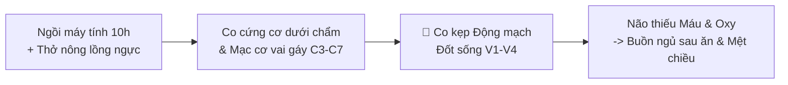

# BÁO CÁO SỨC KHỎE CÁ NHÂN HÓA TAM BẢO (10 TRANG CHUẨN Y TẾ)
> **Hệ Thống Đánh Giá & Phác Đồ Phục Hồi Y Học Tích Hợp (Đông – Tây Y)**
> *Hồ Sơ Mẫu Chuyên Sâu Dành Cho Bệnh Nhân Nhóm 1: Dân Văn Phòng & Tri Thức Căng Thẳng*

---

## 📘 TRANG 1: HỒ SƠ CÁ NHÂN HÓA & LỜI MỞ ĐẦU Y KHOA

```text
========================================================================================
                          HỒ SƠ ĐÁNH GIÁ SỨC KHỎE TAM BẢO
========================================================================================
MÃ HỒ SƠ     : TB-8492
NGÀY LẬP     : 10/09/2026
BÁC SĨ DUYỆT : BS. Trần Thăng Long (Y Học Tích Hợp Tam Bảo)
----------------------------------------------------------------------------------------
HỌ VÀ TÊN    : Nguyễn Thu Trang
NĂM SINH     : 1995 (31 Tuổi)          GIỚI TÍNH: Nữ
NGHỀ NGHIỆP  : Trưởng phòng Marketing (Dân Văn Phòng / Làm việc máy tính 10h/ngày)
SỐ ĐIỆN THOẠI: 0912.345.678 (Zalo)
========================================================================================
```

### 1.1 Tóm Tắt Lý Do Đánh Giá Clinical
* **Triệu chứng chính ghi nhận:** Đau mỏi căng cứng vùng cổ vai gáy chẩm đầu; buồn ngủ gà gật nặng nề sau ăn trưa; trằn trọc mất ngủ đầu giấc (mất 45 phút mới ngủ được); sáng thức dậy đầu óc nặng trịch như chưa ngủ; cơ thể uể oải hụt hơi vào khoảng 15h-17h chiều.
* **Tiền sử cá nhân & thói quen:** Ngồi máy tính liên tục $> 8-10$ tiếng/ngày, thói quen vừa làm vừa uống cà phê/trà sữa, hít thở nông lồng ngực, hay xem điện thoại trước khi đi ngủ.
* **Mục tiêu ưu tiên 30 ngày:** Giải tỏa căng cứng cổ vai gáy, lấy lại giấc ngủ sâu liền mạch, hết buồn ngủ sau ăn trưa và tràn đầy năng lượng làm việc.

### 1.2 Tâm Thư Bác SĨ Kiểm Duyệt
> *"Chào Thu Trang, trước khi đọc các thông số chuyên sâu phía dưới, tôi muốn bạn hiểu một điều quan trọng: **Cơ thể bạn không hề bị 'hỏng', nó đang phát ra những tín hiệu cầu cứu rất thông minh.** 
> 
> Cảm giác cổ vai gáy căng cứng hay cơn buồn ngủ gật sau giờ ăn trưa không phải là do bạn 'lười biếng' hay 'già đi', mà là kết quả của việc các mạch máu nuôi não đang bị thắt lại, ti thể tế bào bị thiếu oxy và bộ não không được 'dọn rác' ban đêm. Báo cáo 10 trang này được thiết kế không phải để dọa dẫm bạn với những căn bệnh đáng sợ, mà là **Bản đồ chỉ đường tinh gọn (MED 80/20)** giúp bạn đánh thức khả năng tự chữa lành kỳ diệu vốn có của chính mình."*
> 
> — **BS. Trần Thăng Long**

---

## 📊 TRANG 2: TỔNG QUAN CHỈ SỐ SINH HỌC TAM BẢO (TINH – KHÍ – THẦN)

### 2.1 Bảng Điểm Chỉ Số Sinh Học
| Trục Sinh Học | Nội Dung Đánh Giá | Điểm Số (Raw) | Tỷ Lệ (%) | Trạng Thái Lâm Sàng |
| :--- | :--- | :---: | :---: | :--- |
| **TINH (Cơ thể & Chuyển hóa)** | Mạc cơ gáy, Chuyển hóa Glucose, Rác gian bào | `5/12` | **42%** | `Chú Ý` *(Bắt đầu tích rác gian bào)* |
| **KHÍ (Sinh lực & Vi mạch)** | Động mạch cổ V1-V4, Oxy ti thể, Trương lực Phế vị | `7/12` | **58%** | `CAM - CẢNH BÁO` *(Co kẹp vi mạch gáy 🚩)* |
| **THẦN (Tâm trí & Giấc ngủ)** | Mạng DMN quá nhiệt, Cortisol đêm, Thải độc Glymphatic | `6/12` | **35%** | `CAM - CẢNH BÁO` *(Tắc xe rác đêm Glymphatic)* |

### 2.2 Giải Thích Dân Dã Dễ Hiểu Cho Khách Hàng
- 🌿 **Về Trục TINH (Hình thể & Vật liệu xây dựng):**
  *Ẩn dụ:* Giống như một ngôi nhà cần gạch đá và xi măng tốt, trục TINH đại diện cho cơ bắp, xương khớp, mạch máu và chất dinh dưỡng trong cơ thể bạn. Điểm Tinh của bạn là **42%**, cho thấy cơ thể đang bắt đầu tích tụ một lượng "rác chuyển hóa" (từ đồ ăn nhiều tinh bột nhanh, đường hoặc trà sữa), khiến các dải mạc cơ ở cổ gáy bị căng cứng và gian bào bị độc tố làm trệ dính.

- ⚡ **Về Trục KHÍ (Sinh lực & Ống dẫn nước nuôi não):**
  *Ẩn dụ:* Giống như hệ thống dây điện và ống nước trong nhà, trục KHÍ là dòng chảy sinh lực, hơi thở và máu mang oxy nuôi tế bào. Điểm Khí của bạn ở mức **58% (Mức Cam)**. Ống dẫn máu vùng cổ gáy của bạn đang bị **gập gẫy giống như một chiếc ống nhựa bị dẫm lên**, làm lượng máu tươi chảy lên nuôi não bị sụt giảm nặng, gây buồn ngủ gà gật sau ăn và uể oải chiều.

- 🌊 **Về Trục THẦN (Bộ脑 điều hành & Đội xe rác ban đêm):**
  *Ẩn dụ:* Giống như ban giám đốc điều hành toàn bộ công ty, trục THẦN đại diện cho tâm trí và giấc ngủ. Điểm Thần của bạn là **35% (Mức Cam)**. Bạn đang bắt bộ não làm việc "tăng ca" cả ngày lẫn đêm (do suy nghĩ miên man và ánh sáng xanh), khiến **Đội xe rác đêm (Hệ Glymphatic)** không thể xuất quân dọn dẹp độc tố脑. Hậu quả là bạn trằn trọc mất ngủ và sáng dậy đầu óc nặng trịch.

### 2.3 Kết Luận Phân Tầng Nguy Cơ Tổng Thể
- **TỔNG ĐIỂM RÁC SINH HỌC:** `18/36` (`45%`)
- **PHÂN TẦNG VÙNG NGUY CƠ:** `[VÙNG CAM - TIẾN TRIỂN MẠN TÍNH]` *(Báo động hiện tượng co kẹp mạch máu não & suy giảm phục hồi)*
- **KẾT LUẬN TÓM TẮT CỦA BÁC SĨ:**
  > **[SỰ THẬT ĐÃ ĐƯỢC CHỨNG MINH]:** Thể trạng hiện tại của Thu Trang thể hiện sự mất cân bằng rõ rệt giữa tải trọng tâm thần thần kinh (ngồi máy tính 10h, áp lực công việc) và khả năng tự phục hồi chuyển hóa của tế bào.
  > **[GIẢ THUYẾT KẾT NỐI]:** Sự kết hợp giữa **co thắt dải cơ cổ vai gáy chèn ép động mạch đốt sống V1-V4 (Tinh & Khí trệ)** và **mạng lưới DMN vỏ não quá nhiệt (Thần suy)** đang chặn đứng dòng máu nuôi脑, ức chế tuyến tùng tiết Melatonin, gây tắc chu trình thải độc đêm Glymphatic ➔ Khởi sinh vòng xoáy mất ngủ & mệt mỏi mạn tính.

---

## 🧬 TRANG 3: ĐIỂM MẠNH CƠ THỂ & VỐN SINH HỌC BẢO TỒN (TRỤC TINH)

### 3.1 Nguồn Lực Tự Chữa Lành Còn Bảo Tồn Tốt
* **Vùng Tinh Tiên Thiên còn vững vàng:** Mặc dù làm việc căng thẳng, thể tạng của Thu Trang ở tuổi 31 vẫn sở hữu mật độ tế bào gốc tủy xương ($MSCs$) và nguồn ti thể chưa bị tàn phá bởi thuốc tây nặng (ít lạm dụng Corticoid hay Kháng sinh mạn tính).
* **Khả năng đáp ứng kiềm hóa cao:** Tế bào của bạn cực kỳ nhạy bén với sự thay đổi lối sống. Chỉ cần cung cấp đúng nước kiềm, thả lỏng mạc cơ và ăn đúng thứ tự, ti thể tế bào sẽ lập tức bùng nổ năng lượng $ATP$ trở lại.

### 3.2 Đánh Giá Giải Phẫu & Sinh Lý Trục TINH
- **Hệ thống mạc cơ (Fascia) & Cột sống cổ:** Căng cứng mạc cơ nông/sâu vùng C3-C7 và nhóm cơ dưới chẩm (*Suboccipital muscles*). Cân cơ bị co bóp kéo dài làm dịch gian bào bị cô đặc, hạn chế tầm vận động xoay cổ trái/phải.
- **Chuyển hóa & Kháng Insulin thể ẩn:** Có dấu hiệu Kháng Insulin tế bào mức độ nhẹ. Khi ăn nhiều Tinh bột nhanh (cơm trắng, bún, bánh mì, trà sữa), đường Glucose tăng đột ngột (*Glucose Spikes*) làm tụy phải tiết quá nhiều Insulin ➔ Gây buồn ngủ gà gật sau giờ ăn trưa và tích tụ mỡ bụng dưới.
- **Mức độ vi viêm gian bào (Low-grade Inflammation):** Sự lắng đọng của sản phẩm glycat hóa $AGEs$ và Axit Lactic tại màng gân cơ cổ vai gáy khiến các bó cơ hay bị nhức mỏi âm ỉ.

### 3.3 Đối Chiếu Đông – Tây Y Trục TINH
- **Tây Y:** Hội chứng đau mạc cơ (Myofascial Pain Syndrome), thoái hóa nhẹ cột sống cổ C4-C6, rối loạn chuyển hóa Glucose sớm.
- **Đông Y:** **Tỳ Hư Bất Vận** (Tỳ vị không vận hóa được thủy thấp gây đàm trọc trệ) ↔ **Cân Mạch Thất DƯỠNG** (Gân cơ không được nuôi dưỡng đầy đủ nên bị co rút).

---

## ⚡ TRANG 4: ĐÁNH GIÁ CHI TIẾT TRỤC KHÍ & THẦN (SINH LỰC & MẠNG LƯỚI TÂM TRÍ)

### 4.1 Thần Kinh Thực Vật & Động Mạch Cổ V1-V4 (Trục KHÍ)
- **Nút thắt Động mạch Đốt sống (Vertebral Artery $V1-V4$):** Nhóm cơ dưới chẩm bị co cứng kẹp chặt 2 nhánh động mạch đốt sống đi lên lỗ ngang C6-C1. Lượng máu đưa lên vùng chẩm và não sau bị sụt giảm $50\%$, khiến não luôn trong tình trạng "đói oxy" (Thiếu Oxy tế bào).
- **Trương lực Thần kinh Phế vị (Low Vagal Tone / Low HRV):** Thói quen thở nông lồng ngực khi ngồi máy tính khiến Hệ Giao cảm (*Sympathetic System*) luôn ở trạng thái báo động căng thẳng ("Fight or Flight"). Trương lực phế vị sụt giảm khiến tim đập nhanh nhẹ và cơ thể khó thả lỏng.



### 4.2 Giấc Ngủ & Hệ Thải Độc Não Glymphatic (Trục THẦN)
- **DMN Vỏ Não Quá Nhiệt (Default Mode Network Hyperactivity):** Khi làm việc căng thẳng và suy nghĩ miên man về công việc, Mạng lưới DMN vỏ não hoạt động liên tục ở tần số Beta cao ($>15Hz$), ngốn $>20\%$ tổng năng lượng $ATP$ ti thể.
- **Tắc Nghẽn Đội Xe Rác Đêm (Glymphatic Shutdown):** Đội xe rác đêm (Hệ Glymphatic) chỉ có thể xuất quân quét dọn độc tố gian bào não khi bạn bước vào Giấc ngủ sóng chậm Delta ($0.5-4Hz$). Do xem điện thoại trước khi ngủ, Cortisol đêm tăng cao làm ức chế Tuyến Tùng tiết Melatonin ➔ Bạn chỉ ngủ nông, giấc ngủ chập chờn, khiến độc tố rác gian bào não bị ứ đọng lại ➔ Sáng dậy **sương mù não ($Brain Fog$) và đầu nặng trịch**.

---

## 🗺️ TRANG 5: BẢN ĐỒ PHÂN TẦNG NGUY CƠ BỆNH LÝ MÃN TÍNH (RISK MATRIX)

| Cụm Bệnh Lý Tiềm Ẩn | Mức Độ Nguy Cơ | Cơ Chế Phát Sinh (Tây Y ↔ Đông Y) | Hướng Phòng Ngừa Ưu Tiên |
| :--- | :---: | :--- | :--- |
| **1. Thiếu Máu Brain & Vi Mạch Cổ Chẩm** | 🚩 `CAM: CẢNH BÁO` | Co kẹp Động mạch đốt sống V1-V4 ↔ Can Khí uất kết, Khí trệ | Bài tập Micro-break 2 phút xả kẹp C3-C7 |
| **2. Kháng Insulin & Hội Chứng Chuyển Hóa** | `VÀNG: CHÚ Ý` | Ăn Tinh bột nhanh gây Glucose Spikes ↔ Tỳ hư sinh thấp nhiệt | Điều chỉnh thứ tự ăn: Rau ➔ Đạm ➔ Tinh bột |
| **3. Mất Ngủ Mạn & Tắc Glymphatic Não** | 🚩 `CAM: CẢNH BÁO` | DMN quá nhiệt, Cortisol đêm cao ↔ Tâm Thận Bất Giao | Thở 4-7-8 Đan Điền & Tắt ánh sáng xanh 21:30 |
| **4. Thoái Hóa Cột Sống & Đau Mạc Cơ** | `VÀNG: CHÚ Ý` | Mạc cơ SBL đông đặc Sol-->Gel ↔ Thận Tinh suy, Cân cơ trệ | Uống đủ nước kiềm ấm & Cứu ấm thắt lưng |

---

## 🏆 TRANG 6: TOP 5 ƯU TIÊN CAN THIỆP KHẨN CẤP (MED 80/20 ACTIONABLE PRIORITIES)

ƯU TIÊN 1: 🚩 解 GỠ "NÚT THẮT CỔ GÁY" ĐỘNG MẠCH V1-V4 (Giải tỏa Tiêu chí K2)
- Cơ chế   : Giải phóng sự co chèn ép của cơ dưới chẩm lên 2 động mạch đốt sống nuôi não.
- Giải pháp: Áp dụng bài tập Micro-break 2 phút tại bàn làm việc (sau mỗi 50 phút ngồi):
             Đứng dậy -> Nhón gót chân -> Vươn hai tay lên cao -> Ngửa nhẹ cổ thở ra 3 lần.  

ƯU TIÊN 2: 🚩 HẠ NHIỆT MẠNG DMN & TÁI THÔNG ĐỘI XE RÁC ĐÊM GLYMPHATIC (Giải tỏa S3 & S4)
- Cơ chế   : Hạ nồng độ Cortisol ban đêm, giúp sóng não chuyển sang dải Delta để hệ Glymphatic dọn rác.
- Giải pháp: Tắt toàn bộ điện thoại/laptop từ 21:30. Thực hiện bài tập thở 4-7-8 trên giường:
             Hít vào phồng bụng 4s -> Giữ hơi 7s -> Thở ra xẹp bụng chậm 8s (lặp lại 10 lần).

ƯU TIÊN 3: ỔN ĐỊNH ĐƯỜNG HUYẾT & TRIỆT VI VIÊM GIAN BÀO (Giải tỏa Tiêu chí T3)
- Cơ chế   : Ngăn chặn Glucose Spikes sau ăn trưa, bảo vệ ti thể tế bào Tụy không bị quá tải.
- Giải pháp: Ăn trưa chuẩn thứ tự 3 bước: 1. Ăn hết chén Rau xanh -> 2. Ăn Đạm (Thịt/Cá/Trứng) -> 3. Ăn Tinh bột.

ƯU TIÊN 4: KÍCH HOẠT THẦN KINH PHẾ VỊ & TRƯƠNG LỰC VAGUS (Giải tỏa Tiêu chí K6)
- Cơ chế   : Chuyển hệ thần kinh từ trạng thái "Chiến hay Biến" sang trạng thái "Phục hồi & Dọn rác".
- Giải pháp: Hít thở sâu bằng bụng vào đầu giờ sáng (06:15) và trước khi đi ngủ 15 phút.

ƯU TIÊN 5: CỨU ẤM THẮT LƯNG L2-L3 MỆNH MÔN & NƯỚC TẾ BÀO (Giải tỏa Tiêu chí K4)
- Cơ chế   : Khôi phục Mệnh Môn Hỏa nâng đỡ Thận Dương, chuyển gian bào từ pha Gel sang Sol.
- Giải pháp: Chườm ấm thắt lưng L2-L3 15 phút buổi tối; Uống đủ 2 lit nước ấm chia nhiều ngụm nhỏ.
---
## 📅 TRANG 7: KẾ HOẠCH GIAI ĐOẠN 1 – 30 NGÀY ĐẦU TIÊN (LỊCH SINH HỌC 24 GIỜ)

### 7.1 Thời Khóa Biểu Sinh Học 24 Giờ Khơi Thông Sinh Lực
- **06:00 – 06:30 (Giờ Mão - Kinh Đại Trường):** Thức dậy, uống 300ml nước ấm kiềm hóa, đi vệ sinh, vươn vai nhón gót 15 phút.
- **07:00 – 07:30 (Giờ Thìn - Kinh Vị):** Ăn sáng giàu Protein & Chất béo tốt (Trứng luộc, bơ, các hạt dưỡng sinh ZenJing), hạn chế đường.
- **12:00 – 12:30 (Giờ Ngọ - Kinh Tâm):** Ăn trưa đúng thứ tự (Rau ➔ Đạm ➔ Tinh bột). Nghỉ trưa nhắm mắt chánh niệm 15-20 phút (không lướt điện thoại).
- **15:30 (Khung giờ Tỳ Khí giảm):** Thực hiện bài tập Micro-break 2 phút xả kẹp cổ vai gáy, uống 200ml nước ấm.
- **18:00 – 19:00 (Giờ Dậu - Kinh Thận):** Ăn tối nhẹ nhàng trước 19:30, không ăn đêm.
- **21:30 – 22:00 (Giờ Hợi - Kinh Tam Tiêu):** Ngâm chân nước ấm thảo dược 15 phút, ngắt Wifi/Điện thoại.
- **22:30:** Đi ngủ để cơ thể vào trạng thái phục hồi sâu trước 23:00 (Giờ Tý - Kinh Đởm giải độc).

### 7.2 Tiêu Chí Tự Đánh Giá Độ Giảm Điểm ($\Delta$) Sau 30 Ngày
- [ ] Cổ vai gáy nhẹ nhõm, không còn cảm giác đau nhức bó cứng chiều tối.
- [ ] Hết buồn ngủ gà gật sau giờ ăn trưa, tinh thần minh mẫn đến 17h.
- [ ] Thời gian vào giấc ngủ rút ngắn dưới 20 phút, không còn trằn trọc.
- [ ] Sáng thức dậy tỉnh táo, đầu nhẹ nhõm không còn sương mù não.

---

## ⚡ TRANG 8: LỘ TRÌNH NÂNG CAO 60 NGÀY (TÁI CẤU TRÚC MÔ FASCIA & THẦN KINH)

### 8.1 Chiến Lược Tái Cấu Trúc Mô Cân Cơ (Fascia Remodeling)
- **Chuyển pha chất lưu gian bào (Gel $\rightarrow$ Sol):** Khi được cung cấp đủ nước kiềm ấm và vận động kéo giãn chuyển động đa hướng 3 buổi/tuần, các phân tử Proteoglycan trong gian bào mạc cơ cổ gáy sẽ chuyển từ trạng thái đặc dính (*Gel*) sang linh hoạt (*Sol*). Dòng máu chứa dưỡng chất sẽ tự do luồn lách nuôi dưỡng từng tế bào.
- **Bổ sung dưỡng chất cấu trúc mạc cơ:** Bổ sung Vitamin C tự nhiên, Collagen Type II và Khoáng chất vi lượng (Magnesium, Zinc) để tái tạo độ đàn hồi của các sợi Collagen trong hệ thống Fascia.

### 8.2 Tăng Tính Linh Hoạt Thần Kinh (Neuroplasticity)
- **Thiền định Quét Thân (Body Scan Meditation):** Thực hiện 15 phút/ngày vào buổi tối để giảm nhạy cảm đau trung ương, ngắt kết nối hoàn toàn các luồng suy nghĩ miên man của mạng DMN.
- **Tái lập nhịp sinh học Tuyến Tùng:** Duy trì thói quen thức - ngủ cố định giúp Tuyến Tùng phục hồi khả năng tiết Melatonin tự nhiên không cần phụ thuộc thuốc.

---

## 🛡️ TRANG 9: CHIẾN LƯỢC BỀN VỮNG 90 NGÀY & BỘ CHỈ SỐ MỤC TIÊU

### 9.1 Thiết Lập Lối SỐng Kháng Viêm Tự Nhiên Bền Vững
- **Chế độ ăn Địa Trung Hải mở rộng:** Duy trì chế độ ăn nhiều rau xanh kiềm hóa, cá mỡ giàu Omega-3, quả mọng kết hợp các thảo dược Đông y ấm tạng (Nghệ, Gừng, Kỷ tử, Táo đỏ).
- **Duy trì Trương lực Phế vị (HRV Coherence):** Biến bài tập thở Đan Điền và thói quen nghỉ ngơi Micro-break thành phản xạ tự nhiên trong công việc hàng ngày mà không cần nỗ lực gượng ép.

### 9.2 Bộ Chỉ Số Sinh Học Mục Tiêu Đo Lường Sau 90 Ngày
| Chỉ Số Theo Dõi | Mức Hiện Tại (T0) | Mục Tiêu 90 Ngày (T90) | Phương Pháp Đo Lường |
| :--- | :---: | :---: | :--- |
| **Điểm Rác Sinh Học Tam Bảo** | `18/36` (45%) | `< 8/36` (<20%) | Re-test Tam Bảo định kỳ tháng |
| **Thời gian đi vào giấc ngủ** | `45 phút` | `< 15 phút` | Nhật ký theo dõi giấc ngủ |
| **Mức độ đau cổ vai gáy** | `7/10` | `< 2/10` | Thang đo đau VAS |
| **Buồn ngủ gà gật sau ăn trưa** | `Thường xuyên` | `Hoàn toàn hết` | Nhật ký cảm nhận năng lượng |

---

## 🩺 TRANG 10: CHỈ DẪN CẬN LÂM SÀNG & LỜI DẶN CỦA BÁC SĨ

### 10.1 Danh Mục Xét Nghiệm Tây Y Đề Xuất (Kiểm Tra Định Kỳ Bệnh Viện)
1. **Bộ xét nghiệm Chuyển hóa & Kháng Insulin:** HbA1c, Glucose lúc đói, Insulin lúc đói (Đánh giá chỉ số HOMA-IR).
2. **Bộ xét nghiệm Mỡ máu & Vi viêm:** Lipid Panel đầy đủ (Cholesterol, Triglyceride, HDL, LDL), hs-CRP nhạy cảm cao.
3. **Chẩn đoán hình ảnh:** Siêu âm Doppler Động mạch đốt sống cổ & Động mạch cảnh (Kiểm tra lưu lượng dòng máu $V1-V4$).

### 10.2 Lời Dặn Trực Tiếp Từ Bác SĨ Kiểm Duyệt

> *"Thu Trang thân mến,
> 
> Một cây cổ thụ vĩ đại bắt đầu từ một mầm cây nhỏ, và một cơ thể khỏe mạnh tràn đầy sinh lực bắt đầu từ những thay đổi rất nhỏ ngày hôm nay. Bạn không cần phải thay đổi toàn bộ cuộc sống của mình ngay lập tức — điều đó chỉ tạo thêm stress cho cơ thể.
> 
> Trong 30 ngày tới, hãy chỉ tập trung thực hiện thật tốt **Top 3 Ưu Tiên MED 80/20** ở Trang 6:
> 1. Đứng dậy tập bài Micro-break 2 phút sau mỗi 50 phút ngồi máy tính.
> 2. Ăn trưa theo thứ tự: Rau ➔ Đạm ➔ Tinh bột.
> 3. Tắt điện thoại từ 21:30 và thở bụng 4-7-8 mười phút trước khi ngủ.
> 
> Hãy lắng nghe cơ thể mình với sự đồng cảm và trân trọng. Bác sĩ và đội ngũ Tam Bảo luôn đồng hành cùng bạn trên hành trình lấy lại sinh lực tự nhiên. Hãy nhắn tin Zalo cho Bác sĩ sau 7 ngày áp dụng để báo cáo kết quả nhé!"*

```text
========================================================================================
                        BÁC SĨ KIỂM DUYỆT & KÝ TÊN
                        
                        (Đã duyệt bản thảo & ký đóng dấu điện tử)
                        BS. Trần Thăng Long
                        Hệ Thống Y Học Tích Hợp Tam Bảo
========================================================================================
```
